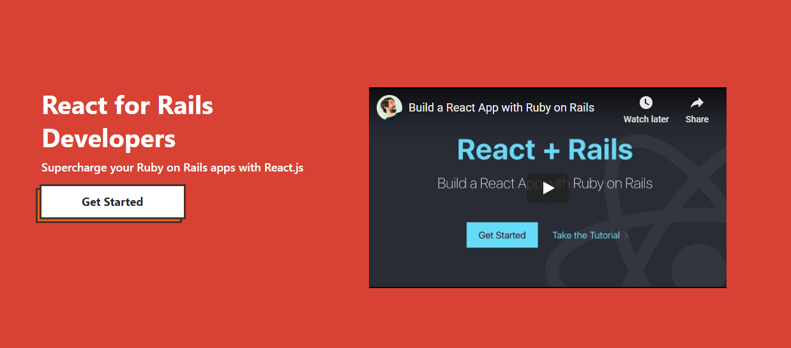
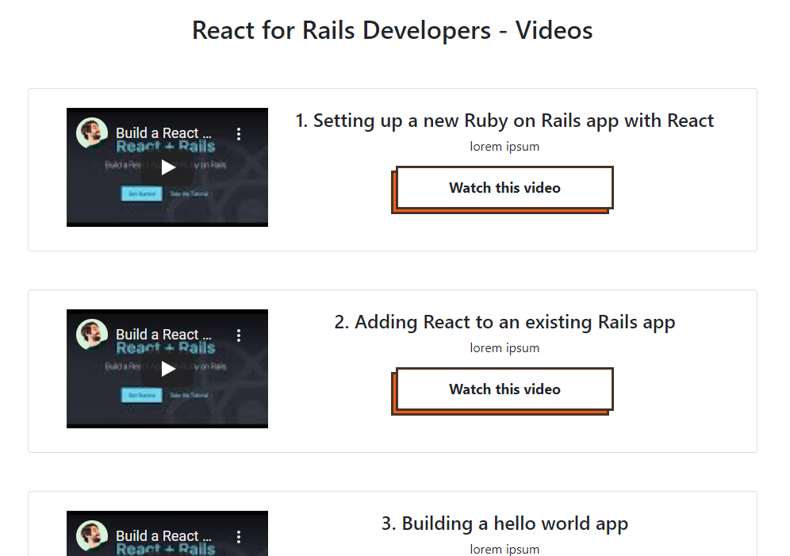

# Project: React and Rails App

This is a project for building an app that list tutorials on how to add ReactJS to a Ruby on Rails app. Inside the app, there are tutorials from youtube showcasing how to connet ReactJS to a Ruby on Rails app or How to start a new app that is already bundled with ReactJS

## Built With

- HTML
- Bootstrap
- Styled Components
- ReactJS
- Webpack
- Node
- Ruby on Rails
- Axios

## Live Version

[Live Link](live.com/)

## Getting Started

Open your terminal or text editor and use next command

        git clone https://github.com/emmanuelkamala/react-rails-app.git

        cd react-rails-app

        Run 'bundle install' command to install dependencies.

## Run the index file

To run the index file and see the project; enter this command on the command line:
'rails s'

Then open the browser and enter this link:
http://localhost:3000

After if you want to do any changes please create new branch, after changes open pull request.
Happy coding! 

## Authors

👤 **Author1**

- Github: [emmanuelkamala](https://github.com/emmanuelkamala)
- Twitter: [ejkamala](https://twitter.com/ejkamala)
- Linkedin: [emmanuelkamala](https://linkedin.com/in/emmanuelkamala)

## 🤝 Contributing

Contributions, issues and feature requests are welcome!

Feel free to check the [issues page](issues/).

## Show your support

Give a ⭐️ if you like this project!

## Acknowledgments

- The odin project
- Microverse tips

## 📝 License

This project is [MIT](lic.url) licensed.
